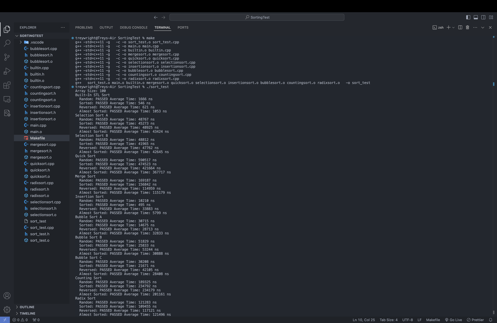

# Sorting Algorithms
Preview:


## Sorting Algorithms Implamented

- **Selection Sort A**: Swaps elements each time during selection.
- **Selection Sort B**: Only swaps at the end of selection.
- **Merge Sort**: A divide-and-conquer algorithm that merges sorted subarrays.
- **Quick Sort**: An efficient sorting algorithm using partitioning.
- **Insertion Sort**: Builds the final sorted array one item at a time.
- **Bubble Sort A**: Bubble sort without swap detection.
- **Bubble Sort B**: Bubble sort with swap detection starting from the beginning.
- **Bubble Sort C**: Bubble sort with swap detection starting from the end.
- **Counting Sort**: Counts the occurrences of each unique element.
- **Radix Sort**: Sorts numbers digit by digit using binary radix and bitwise counting.

## Installation

To get started with this project, follow these simple steps:

1. **Clone the Repository**:
   ```bash
   git clone https://github.com/yourusername/MoreSortingAlgorithms.git
   cd MoreSortingAlgorithms
   ```

2. **Compile the Source Files**:
   Make sure you have a C++ compiler installed (e.g., g++) and run:
   ```bash
   just do "make"
   ```

3. **Run the Program**:
   After compiling, run the executable:
   ```bash
   ./sort_test
   ```

## Algorithms Overview

### Selection Sort A
- **Description**: Repeatedly selects the smallest (or largest) element from the unsorted portion of the array and swaps it with the first unsorted element.
- **Time Complexity**: O(n²)

### Selection Sort B
- **Description**: Similar to Selection Sort A, but instead of swapping elements during each selection, it finds the minimum and only swaps once at the end of the iteration.
- **Time Complexity**: O(n²)

### Merge Sort
- **Description**: A divide-and-conquer algorithm that recursively divides the array into halves until it can be easily sorted, then merges the sorted halves back together.
- **Time Complexity**: O(n log n)

### Quick Sort
- **Description**: Selects a "pivot" element and partitions the other elements into two sub-arrays according to whether they are less than or greater than the pivot. The sub-arrays are then sorted recursively.
- **Time Complexity**: Average O(n log n), Worst O(n²)

### Insertion Sort
- **Description**: Builds the final sorted array one item at a time by repeatedly inserting a new element into the already sorted portion.
- **Time Complexity**: O(n²)

### Bubble Sort A
- **Description**: Repeatedly steps through the list, compares adjacent elements, and swaps them if they are in the wrong order. Does not detect if the list is already sorted.
- **Time Complexity**: O(n²)

### Bubble Sort B
- **Description**: Enhances Bubble Sort A by adding swap detection. If no swaps occur during a pass, the algorithm terminates early.
- **Time Complexity**: O(n²) but can be faster on nearly sorted arrays.

### Bubble Sort C
- **Description**: Implements bidirectional Bubble Sort (Cocktail Shaker Sort) with swap detection, starting from the end of the list and working towards the beginning.
- **Time Complexity**: O(n²)

### Counting Sort
- **Description**: Counts the number of occurrences of each unique element and uses this count to determine the positions of elements in the sorted array.
- **Time Complexity**: O(n + k), where k is the range of input.

### Radix Sort
- **Description**: Sorts numbers digit by digit, starting from the least significant digit to the most significant digit, using Counting Sort as a subroutine.
- **Time Complexity**: O(nk), where k is the number of digits.
